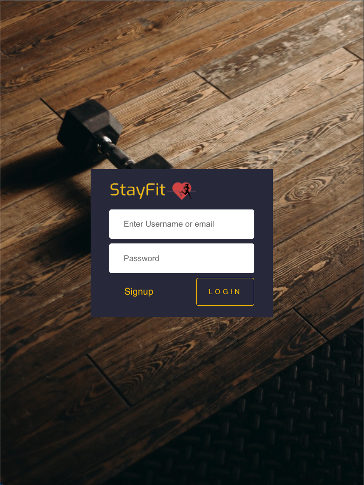

# StayFit

StayFit is a fitness-focused scheduling application that lets users plan & keep track of their exercises for the upcoming days.

React based frontend with JSX, SASS and Material UI. Backend made with NodeJS, Express and PostgreSQL.

Application deployed using Netlify and Heroku. Visit application here: [StayFit](https://stayfit-v01.netlify.app).

<!--  -->



### Dashboard:


### Calender:


### Exercises Search:


___
## Getting Started
There are two methods of accessing the application:

1. Visit website online hosted by Netlify: [StayFit](https://stayfit-v01.netlify.app)

<p align="center">
  or
</p>

2. Clone the Stayfit repository and run application locally

___
## 1 - Using the application online

1. Visit website online here: [StayFit](https://stayfit-v01.netlify.app)

    URL: https://stayfit-v01.netlify.app

    *Note: Webpage data may take a few seconds to load up on first use due to the database needing to fire up first. 


## 2 - Using the application locally

1. Fork/clone the [StayFit Repo](https://github.com/sonia0409/StayFit) repo to your local device.

```js
git clone git@github.com:sonia0409/StayFit.git
```

3. Install dependencies for client and server using the `npm install` command.

Client:
```js
cd client
npm install
```

Server:
```js
cd server
npm install
```

4. Starting/Running the application

Client:
```js
cd client
npm start
```

Server:
```js
cd server
npm startTSC
```

5. Go to <http://localhost:3000/> in your browser.

6. Sign up for an account and login in. 

7. Schedule your exercises and explore away!

## Dependencies

Frontend:
- React
- React-Router-Dom/React-Dom
- Axios
- Material UI
- SASS

Backend:
- Express
- Node v12.22.5
- body-parser
- cors